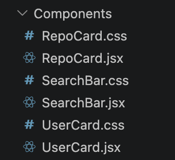
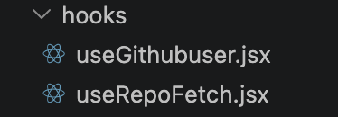

# Github Repo Finder
 This github repo utilises a live search input field to fetch the github profile built using React

 Hosted link: https://github-repo-finder-k1ae.vercel.app/

 ## Concepts Utilised
 1. React Functional Components
 2. Props, State variables, useRef for DOM manipulation
 3. Custom Hooks that utilise useEffect
 4. react-icons for search symbol
 5. react-spinners for loading spinner
 6. debouncing logic for useEffect
 7. list rendering for displaying repos


 ## Methodology
1. Components



2. Custom hooks



## Component structure
Eg. for visual clarity

```js
<App> ---> Calls useGithubUser Hook
  <form>
    <SearchBar />
    <UserCard>
      <RepoCard /> ---> calls useRepoFetch Hook
    </UserCard>
  </form>  
</App>
```

## App.jsx
```js
  const [username,setUsername] = useState('');
  const [loading, setLoading] = useState(false);
  const [showRepo, setShowRepo] = useState(false);
  const {data,error} = useGithubuser(username,setLoading)
  ```

  State variables managed by App, I lifted it to the parent component since both `<SearchBar />` and `<UserCard />` uses them

  username --> stores the user input
  loading --> when user is in the process of typing or fetching --> activates spinner
  showRepo --> to control repo visiblity logic, lifted from `<RepoCard />` to `<App />` for disabling and enabling the `<RepoCard />`
  data --> stores the fetched data from api - passed as props to `<UserCard />`
  error --> error state returned by the custom hook if fetch fails


  ## useGithubUser Custom Hook
  
  Code:
  ```js
  export default function useGithubuser(username, setLoading) {
  const [data,setData] = useState(null)
  const [error,setError] = useState(null);

  useEffect(() =>{
    if(!username.trim()){
      setLoading(false)
      return;
    }
    const id = setTimeout(()=>{
    fetch(`https://api.github.com/users/${username}`)
    .then(res => { if(!res.ok){
      throw new Error('User not found')
    }
    return res.json()})
    .then(data => {
      setData(data);
      setError(null)
      setLoading(false)
    })
    .catch((error)=>{
      setError(error);
      setLoading(false)
    })
    
  },1000);
    
    return(()=>{
      clearTimeout(id)}
    );
  },[username,setLoading])

  return {data,error};
}
```

Here the useEffect is directly linked to the `username` state variable through a dependency array - so it will fetch for every keystroke - to avoid this.
We apply a debouncing logic using setTimeOut to wait for 1 second before fetching, if the another useEffect is fired, the cleanup function will terminate the previous fetch.

## SearchBar.jsx

Code:
```js
export default function SearchBar({username, setUsername, setLoading, setShowRepo}){

  return (
    <div className='search-wrapper'>
    
    <input type='text' value={username} onChange={(e)=>{ setUsername(e.target.value)
      setLoading(true)
      setShowRepo(false)
    }} placeholder='Enter GitHub Name' />
    <Search size={18} className="search-icon" />
    </div>
  )
}
```
Here we receive setter function as props and set the loading(spinner) and `<RepoCard />` visibility variable as invisible whenever user is typing

## UserCard.jsx

Code:
```js
export default function UserCard({data, loading, error, username, showRepo, setShowRepo}) {
  const btnRef = useRef(null)
  function showRepos(){
    if(!showRepo){
      btnRef.current.textContent='Close Repos'
    }
    else{
      btnRef.current.textContent='Get Repos'
    }
    setShowRepo(!showRepo)
  }
  if(!username.trim()){
    return( <div className='empty-wrapper'><p>Search for a GitHub user</p></div>);
  }
  if(loading){
    return( <div className='spinner-wrapper'><ClipLoader color="#0d1816" loading={loading} size={50} />
  </div>);}
  if(error){
    return( <div className='error-wrapper'> <p>{error.message}</p></div>);}
  if(data) {
    return (
    <div>
      {console.log(data)}
      <div className='wrapper'>
      <h1>Username: <i><a href={`https://github.com/${username}`} target='_blank'>{data.login}</a></i></h1>
      
      <p className="bio">Bio: {data.bio}</p>
      <p className="flwrs">Followers: {data.followers}</p>
      <p className="repocount">Repos: {data.public_repos}</p>
      <button onClick={showRepos} ref={btnRef} > Get Repos</button>
      </div>
      {showRepo && <RepoCard username={username} showRepo ={showRepo} /> }
    </div>
  )}
}
```
Here the conditional return statements are for error displaying, spinner showing and finally for displaying User details as a user card.

This component receives most of its data as props from <App />

`btnRef` is used as a useRef hook to control the text content of the button.

`showRepo` is connected to the `<RepoCard/>` for toggling display and setShowRepo controls it.

## RepoCard.jsx

Code:

```js
export default function RepoCard({username,showRepo}) {

  const {repoData, repoError} = useRepoFetch({username, showRepo})
  if(repoError) return( <div className='error-wrapper'> <p>{repoError.message}</p></div>);
  if(!repoData) return( <div className='spinner-wrapper'><ClipLoader color="#0d1816" loading={showRepo} size={50} />
    </div>);
  console.log(repoData)
  if(repoData.length === 0){
    return( <div className='error-wrapper'> <p>User has no Public Repositories</p></div>);
  }
  return (
    
    
      <ol className='repo-wrapper'>{repoData.map(repo => (
        
        <li className='repo-card' key={repo.id}>
          <a href={repo.html_url} className='repo-name' target='_blank'>{repo.name}</a>
        <p className='repo-desc'>{repo.description}</p>
        <div className='repo-highlights'>
        <span className='repo-lan'>● {repo.language}</span>
        <span className='repo-stars'>★ {repo.stargazers_count}</span>
        <span className='repo-forks'>⑂ {repo.forks}</span>
        </div>
        </li>
      
    ))}</ol>
  );
  ```

  Here another custom Hook - `useRepoFetch` is called with the showRepo(variable which checks if user pressed the Get Repos button) and `username` and the fetched data is displayed as a lists rendering
  There are also spinner logic and error logic handling jsx part inside.

  ## useRepoFetch.jsx
  Code:
  ```js
  export default function useRepoFetch({username, showRepo}) {
  const [repoData, setRepoData] = useState(null)
  const [repoError,setRepoError] = useState(null)
  useEffect(()=>{
    if(!showRepo) return;
    const id = setTimeout(()=>{
      setRepoData(null)
      setRepoError(null)
      fetch(`https://api.github.com/users/${username}/repos`)
      .then(res=>{
        if(!res.ok){
          throw new Error(`Couldnt Fetch ${username}'s Repositories`)
        }
        else{
          return res.json()
        }
      })
      .then(repoData => setRepoData(repoData))
      .catch((error)=> setRepoError(error))
    },500)
    return ()=>clearTimeout(id);
  },[username, showRepo])

  return {repoData, repoError}
}
```
works similar to how useGithubUser custom hook workds, it returns both data and error

This sums up everything i have learned till now in react.
some additions: could have used useContext to provide some props, but since the nested layer was short, opted out of it